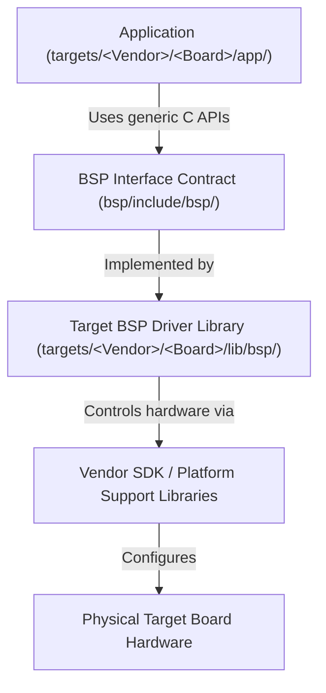

# Target Board Onboarding Blueprint & Template Guide

The core philosophy of the Eclipse ThreadX Reusable BSP Framework is to separate platform-independent application logic from board-specific hardware implementations through abstract C interfaces. By establishing a strict boundary between generic application code and physical registers, the same application source code can be compiled for multiple hardware targets (such as STM32, Raspberry Pi Pico, ESP32, or NXP platforms using vendor SDKs or other platform support packages) without requiring changes to the application itself.

This directory contains the skeletal blueprint for onboarding a new hardware board into the framework.

> [!NOTE]
> **Blueprint Nature**:
> This template is a **documented blueprint**, not a compilable target out-of-the-box. To compile it successfully, the developer must supply target-specific startup assemblies, linker scripts, and a vendor SDK or platform support package.

---

## 1. Dependency Flow Architecture

The following diagram illustrates how application code reaches hardware through the BSP framework rather than through vendor registers directly:



### High-Level Repository Layout

```text
Repository
│
├── bsp/         (Target-agnostic C interface contracts)
├── libs/        (Shared RTOS components: ThreadX, NetX Duo, FileX, USBX)
└── targets/     (Independent board support implementations)
       ├── STMicroelectronics/NUCLEO_F401RE/
       └── Microchip/POLARFIRE_ICICLE_RENODE/
```

---

## 2. Shared Directory Governance & BSP Ownership

To maintain long-term framework maintainability and portability, the following root directories should generally remain **unchanged** when onboarding a new board:

* `/bsp`: Defines the target-agnostic C interface contracts (`board.h`, `led.h`, `console.h`, `memory.h`, `selftest.h`). New board targets must implement these existing interfaces rather than modifying core interface definitions.
* `/libs`: Shared RTOS components consumed by every target as submodules. Targets reference these rather than vendoring their own copy.

> [!NOTE]
> **Applications are currently target-resident.** Each target owns its demo under `targets/<Vendor>/<Board>/app/`, along with its own `cmake/` toolchain files and build helpers. A shared `/apps` layer is a goal of this framework, not something it provides yet, so onboard a new board by starting from the app in this template rather than by linking one from a shared directory. What a demo no longer needs is board headers: `<bsp/memory.h>` covers byte-pool sizing and `<bsp/selftest.h>` covers startup self-tests, so both shipped demos include only `<tx_api.h>` and `<bsp/...>`.

> [!NOTE]
> **Core Architectural Principle**:
> The framework intentionally standardizes only the BSP interface and build structure. Board startup code, linker scripts, and vendor SDK integration remain board-specific.

> [!IMPORTANT]
> **Independent Target BSP Ownership**:
> Each target board owns its BSP implementation independently within `targets/<Vendor>/<BOARD_NAME>/`. No BSP code is shared across target directories, guaranteeing that modifying or updating one board target will never cause side effects or build regressions on another target.

---

## 3. "What Goes Where" Asset Mapping

The table below maps common embedded software components to their designated locations within a target board package:

| Asset / Component | Framework Location | Sourced From |
| :--- | :--- | :--- |
| **Vendor SDK / Platform Libraries** | `targets/<Vendor>/<BOARD>/lib/vendor/` or external CMake package | Official MCU Vendor SDK / Reference Package |
| **Startup Assembly & System Code** | `targets/<Vendor>/<BOARD>/app/common/startup/` | Vendor SDK (`startup_<mcu>.s`, `system_<mcu>.c`) |
| **Linker Script** | `targets/<Vendor>/<BOARD>/app/common/linker/` | Vendor SDK (`<mcu>.ld` or compiler script) |
| **ThreadX Low-Level Setup** | `targets/<Vendor>/<BOARD>/app/common/startup/` | `libs/threadx/ports/<arch>/<compiler>/src/` |
| **BSP Driver Implementation** | `targets/<Vendor>/<BOARD>/lib/bsp/src/` | Target developer (`bsp_board.c`, `bsp_led.c`, `bsp_console.c`, `bsp_memory.c`, `bsp_selftest.c`) |
| **Target Specification Constants** | `targets/<Vendor>/<BOARD>/lib/bsp/include/board_config.h` | Target developer (declarative defines only) |
| **Target Build Automation** | `targets/<Vendor>/<BOARD>/scripts/build.ps1` | Target developer (PowerShell automation template) |
| **Application Code** | `targets/<Vendor>/<BOARD>/app/` | Target developer (start from this template's `app/main.c`) |
| **Toolchain & Build Helpers** | `targets/<Vendor>/<BOARD>/cmake/` | Target developer (cross-compilation settings per target) |

---

## 4. Quick-Start Onboarding Steps

To add support for a new board (e.g. `MY_VENDOR / MY_BOARD`):

1. **Copy the Template Directory**:
   Copy `/templates/target/` to `/targets/<Vendor>/<BOARD_NAME>/`.
   ```bash
   cp -r templates/target targets/MyVendor/MY_BOARD
   ```

2. **Configure Board Hardware Specs**:
   Edit `targets/MyVendor/MY_BOARD/lib/bsp/include/board_config.h`. This file contains **compile-time configuration constants only** (no executable code or function prototypes) and is consumed by the target BSP implementation layer to configure clock trees, UART registers, and dynamic memory boundaries:
   - Set `BSP_SYSTEM_CLOCK_HZ` to your core CPU frequency.
   - Set `BSP_UART_BAUDRATE` to your debug serial speed.
   - Set `BSP_RAM_END` to the physical top address of your MCU SRAM.
   - Set `BSP_MAIN_STACK_RESERVE` to the bytes your board holds back at the top of RAM for the main stack, so `bsp_ram_region()` keeps an application's byte pool clear of it.

3. **Implement Abstract C BSP Drivers**:
   Populate the driver stubs in `targets/MyVendor/MY_BOARD/lib/bsp/src/`:
   - `bsp_board.c`: Configure System Clocks, Flash Wait States, and low-level timers in `bsp_board_init()`.
   - `bsp_led.c`: Configure GPIO pin muxing and implement `bsp_led_on()`, `bsp_led_off()`, `bsp_led_toggle()`.
   - `bsp_console.c`: Configure UART peripheral and implement `bsp_console_write()`.
   - `bsp_memory.c`: Report the RAM the application may claim in `bsp_ram_region()`, subtracting whatever this board reserves for its C heap and stacks.
   - `bsp_selftest.c`: Verify in `bsp_self_test()` that the board came up as configured - clocks, timebase, interrupt routing, and that the C heap cannot grow into the region `bsp_ram_region()` hands out.

4. **Add Startup Files & Linker Script**:
   Obtain the standard startup assembly (`startup_<mcu>.s`), system initialization (`system_<mcu>.c`), and linker script (`<mcu>.ld`) **directly from your MCU vendor's official SDK or reference package** (do not write these from scratch). Developers should avoid modifying vendor startup code unless strictly necessary, as these files are maintained by the silicon vendor. Place them under `targets/MyVendor/MY_BOARD/app/common/startup/` and `targets/MyVendor/MY_BOARD/app/common/linker/`.

5. **Copy the ThreadX Low-Level Setup**:
   Copy the `tx_initialize_low_level.S` assembly file from the **specific ThreadX architecture and toolchain port directory** (`libs/threadx/ports/<arch>/<compiler>/src/`) matching your target MCU core (e.g., Cortex-M4, Cortex-M33, or RISC-V) into your target's startup directory. This file manages core register setups and vector layout for that processor family and should generally be copied unchanged.

6. **Update CMake Configuration**:
   The target's CMake build scripts are responsible for exposing include paths and linking the BSP drivers, vendor SDK, ThreadX kernel, and shared application executable together into the final firmware image:
   - Update `targets/MyVendor/MY_BOARD/CMakeLists.txt` with your target project name and any required vendor SDK configuration.
   - Update `targets/MyVendor/MY_BOARD/lib/CMakeLists.txt` to register vendor SDK libraries and subdirectories.
   - Update `targets/MyVendor/MY_BOARD/app/CMakeLists.txt` to register startup assembly files, system initialization code, linker scripts, target BSP sources, and link against the required ThreadX libraries.

7. **Build and Test**:
   Run the PowerShell build script:
   ```powershell
   powershell -ExecutionPolicy Bypass -File .\targets\MyVendor\MY_BOARD\scripts\build.ps1 -Clean -Rebuild
   ```

---

## 5. Framework Architectural Contract

### Baseline C Interface Headers (`/bsp/include/bsp/`)

The current framework defines the following core baseline C interfaces in `/bsp/include/bsp/`:

| Generic Header | Baseline API | Description |
| :--- | :--- | :--- |
| `<bsp/board.h>` | `bsp_board_init()` | Core MCU clock tree, power scaling, and flash wait state setup. |
| `<bsp/led.h>` | `bsp_led_init()`, `bsp_led_toggle()`, etc. | GPIO user LED initialization and state toggling. |
| `<bsp/console.h>` | `bsp_console_init()`, `bsp_console_write()` | Serial UART initialization and output transmission. |
| `<bsp/memory.h>` | `bsp_ram_region()` | RAM the application may claim, clamped against the board's own heap and stack reservations. |
| `<bsp/selftest.h>` | `bsp_self_test()` | Board startup verification, reported through an application-supplied callback. |

### Target Configuration Component (`board_config.h`)

| Configuration File | Expected Constants | Description |
| :--- | :--- | :--- |
| `board_config.h` | `BSP_RAM_END`, `BSP_MAIN_STACK_RESERVE`, `BSP_SYSTEM_CLOCK_HZ`, `BSP_UART_BAUDRATE` | Compile-time hardware specification constants consumed by the BSP driver implementation layer. |

> [!TIP]
> **Optional Interfaces & Hardware Variants**:
> * The baseline interfaces currently cover core board setup, user LED control, and debug console output. Future versions of the BSP framework may introduce additional optional interfaces (e.g., non-volatile storage, networking, I2C/SPI bus drivers).
> * If a specific target board lacks dedicated LED or UART hardware, implement the interface functions as **no-op implementations** so that generic application binaries continue to link and execute cleanly.
